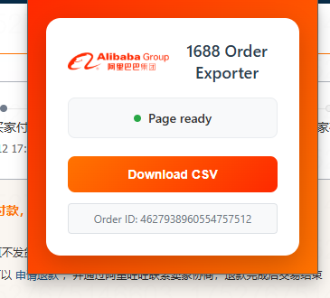
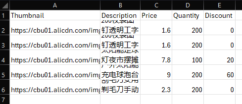

# 1688toCSV Chrome Extension

## Overview

The `1688toCSV` Chrome Extension is designed to simplify the process of extracting order details from 1688.com directly
into a downloadable CSV file. This tool is invaluable for users who frequently need to log or process their 1688 orders,
providing a quick and efficient way to get structured data.

**Intention:** To allow users to export an CSV file containing comprehensive details of their 1688.com orders, making
data management and analysis straightforward.

## Features

- **One-Click Export:** Quickly download order details as a CSV with a single button click.
- **Detailed Information:** Captures essential order data including product descriptions, prices (undiscounted),
  quantities, and discounts.
- **User-Friendly:** Simple interface integrated directly into the Chrome browser.

## Installation (For Local Use in Chrome)

To use this extension locally in your Chrome browser, follow these steps:

1. **Download or Clone the Repository:**

   - If you're downloading directly, click the "Code" button on the GitHub repository page and select "Download ZIP"
     Unzip the file to a location on your computer.
   - If you have Git installed, you can clone the repository using the command:
     ```bash
     git clone https://github.com/1w3j/1688toCSV.git
     ```

2. **Open Chrome Extensions Page:**

   - Open your Chrome browser.
   - Type `chrome://extensions` into the address bar and press Enter.

3. **Enable Developer Mode:**

   - On the Extensions page, toggle on the "Developer mode" switch, usually located in the top-right corner.

4. **Load Unpacked Extension:**

   - Click the "Load unpacked" button that appears.

5. **Select the Project Folder:**

   - A file dialog will open. Navigate to and select the root folder of the `1688toCSV` repository that you downloaded
     or cloned.

6. **Extension Installed:**
   - The extension should now appear in your list of installed extensions. You might need to pin it to your Chrome
     toolbar for easy access (look for a puzzle piece icon in the toolbar, click it, and then click the pin icon next
     to "1688toCSV").

## How to Use

1. **Navigate to your 1688 Order Detail Page:**

   - Open your Chrome browser and go to any 1688.com order detail page (e.g.,
     `https://air.1688.com/app/ctf-page/trade-order-detail/index.html?orderId=...`).

2. **Open the Extension Popup:**

   - Click on the `1688toCSV` extension icon in your Chrome toolbar. This will open a small popup window.

   ### Extension Popup

   

3. **Download the CSV File:**

   - Once the popup confirms "Page ready" (indicated by the green dot and text), click the "Download CSV" button.
   - A CSV file containing the order details will be downloaded to your default downloads folder. The filename will be
     dynamically generated based on the seller name and order suffix (e.g., `SellerName_OrderSuffix.csv`).

   ### Example Exported CSV File

   

## Contribution

Feel free to fork the repository and submit pull requests if you have any improvements or bug fixes.

## TODO

- Implement the calculation of "商品改价" (whole order discount) and distribute it proportionally into each product's
  discount row. Currently, this discount is not included in the individual product discount calculations.
